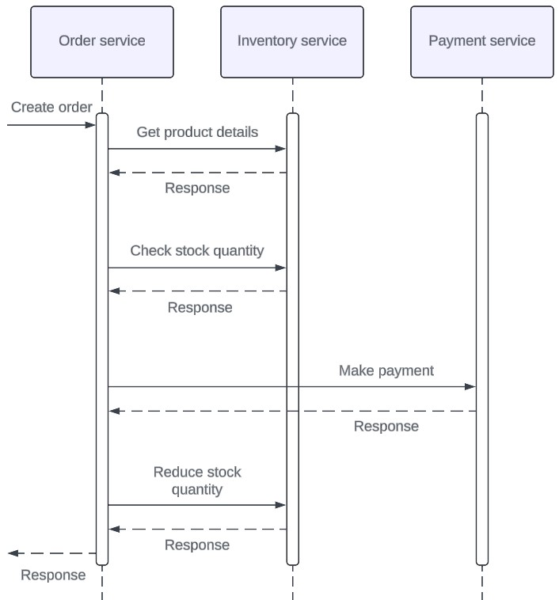

# Overview
An example microservices project that uses gRPC for inter-service communication.

Service API definitons use Protocol Buffers. They are managed along with the generated source code in a separate repository: https://github.com/hollowdll/grpc-microservices-proto

Microservices in this project are written in the Go programming language. They use hexagonal architecture as their inner architectural style.

This project was developed as part of a thesis that discusses the use cases and benefits of using gRPC for synchronous microservice inter-service communication.

# About the project

The project consists of the following 3 microservices:
- Order service
- Inventory service
- Payment service

The goal is to present a simple e-commerce style order operation with gRPC, where an order can have multiple order items with different quantities.

Currently the services are very minimal, because they were mainly designed to showcase synchronous gRPC usage. For this reason they lack a lot of features. The communication flow is also simplified and does not include advanced techniques like circuit breaker pattern or proper error handling.

Here is the flow of the order operation:



The services communicate synchronously with gRPC.

# How to run databases

Inventory service has a PostgreSQL database that stores products. There is a Docker Compose file `docker-compose-db.yaml` to ease the database setup in local environments. It creates the database on initialization and saves the data to a Docker volume. You need Docker to use it. This section uses Linux.

Create a .env.db file to the project root
```sh
touch .env.db
```
Copy the environment variables in the `.env.db.template` file to the file and change the values to desired values. These environment variables will be set in the PostgreSQL container.

Also set environment variable `POSTGRES_HOST_PORT` to port forward your desired host port to the database container. This allows the inventory service to access the database through the port.
```sh
export POSTGRES_HOST_PORT=5432
```

Create and start container
```sh
docker compose -f docker-compose-db.yaml up
```

If running in the backround is preferred
```sh
docker compose -f docker-compose-db.yaml up -d
```

# How to run the microservices

Make sure that you have Go installed. Instructions [here](https://go.dev/doc/install).

You need to use a terminal and be able to type commands.

Clone this repository manually or with Git:
```sh
git clone https://github.com/hollowdll/go-grpc-microservices.git
```

Go to the repository depending on where you cloned it:
```sh
cd go-grpc-microservices
```

It is recommended to have 3 different terminal windows/views open so you can see the output logs of each microservice while running all of them simultaneously in different terminal windows.

You can start a service by going to its directory and then running it.

For example, to start the payment service do the following:
```sh
cd services/payment
go run cmd/main.go
```

After this you should see some output logs telling the service is starting if nothing went wrong.

# How to configure the microservices

By default, the services use default configurations. However, you can change these defaults with configuration files or environment variables, as the [12-factor app](https://12factor.net/) methodology suggests.

## About the configuration files

- The configuration file needs to be in the same directory where you are running the service
- The configuration files use YAML format
- The configuration files are not created automatically
- Environment variables override configurations in the configuration files

## Configure payment service

Configuration file: paymentservice-config.yaml

Configuration file template with default values:
```yaml
GRPC_PORT: 9000
APPLICATION_MODE: development
```

The following table describes the configurations for this service:

Name in config file | Environment variable     | Default value | Description
------------------- | ------------------------ | ------------- | -----------
GRPC_PORT           | PAYMENT_GRPC_PORT        | 9000          | gRPC server port number.
APPLICATION_MODE    | PAYMENT_APPLICATION_MODE | development   | Mode the service runs in. e.g. development, staging, production.

## Configure inventory service

Configuration file: inventoryservice-config.yaml

Configuration file template with default values:
```yaml
GRPC_PORT: 9001
APPLICATION_MODE: development
DB_HOST: localhost
DB_USER: service
DB_PASSWORD: inventory_psw
DB_NAME: inventory_db
DB_PORT: 5432
DB_SSL_MODE: disable
```

The following table describes the configurations for this service:

Name in config file | Environment variable       | Default value | Description
------------------- | -------------------------- | ------------- | -----------
GRPC_PORT           | INVENTORY_GRPC_PORT        | 9001          | gRPC server port number.
APPLICATION_MODE    | INVENTORY_APPLICATION_MODE | development   | Mode the service runs in. e.g. development, testing, staging, production.
DB_HOST             | INVENTORY_DB_HOST          | localhost     | Database host.
DB_USER             | INVENTORY_DB_USER          | service       | Database user.
DB_PASSWORD         | INVENTORY_DB_PASSWORD      | inventory_psw | Database password.
DB_NAME             | INVENTORY_DB_NAME          | inventory_db  | Database name.
DB_PORT             | INVENTORY_DB_PORT          | 5432          | Database port number.
DB_SSL_MODE         | INVENTORY_DB_SSL_MODE      | disable       | Database SSL connection setting. Can be disable, allow, prefer, require, verify-ca, verify-full. Check postgres documentation for details.

## Configure order service

Configuration file: orderservice-config.yaml

Configuration file template with default values:
```yaml
GRPC_PORT: 9002
APPLICATION_MODE: development
INVENTORY_SERVICE_HOST: localhost
INVENTORY_SERVICE_GRPC_PORT: 9001
PAYMENT_SERVICE_HOST: localhost
PAYMENT_SERVICE_GRPC_PORT: 9000
```

The following table describes the configurations for this service:

Name in config file         | Environment variable              | Default value | Description
--------------------------- | --------------------------------- | ------------- | -----------
GRPC_PORT                   | ORDER_GRPC_PORT                   | 9002          | gRPC server port number.
APPLICATION_MODE            | ORDER_APPLICATION_MODE            | development   | Mode the service runs in. e.g. development, staging, production.
INVENTORY_SERVICE_HOST      | ORDER_INVENTORY_SERVICE_HOST      | localhost     | Host or IP address of the inventory service.
INVENTORY_SERVICE_GRPC_PORT | ORDER_INVENTORY_SERVICE_GRPC_PORT | 9001          | Port number of the inventory service's gRPC server.
PAYMENT_SERVICE_HOST        | ORDER_PAYMENT_SERVICE_HOST        | localhost     | Host or IP address of the payment service.
PAYMENT_SERVICE_GRPC_PORT   | ORDER_PAYMENT_SERVICE_GRPC_PORT   | 9000          | Port number of the payment service's gRPC server.

# How to test the microservices' gRPC APIs

Run all of the microservices in development mode. Development mode saves test data to the inventory database. enables gRPC reflection in the service's gRPC servers so they can be tested with tools like grpcurl or Postman.

Check the proto files of each service to know what data is sent in requests and what data is sent back in responses. The proto files can be found [here](https://github.com/hollowdll/grpc-microservices-proto/tree/main/def)

The inventory service creates some products in the test data. Check the output logs of inventory service to see the IDs (in this project product codes) of the test products. In this project they are UUIDs. You need these in the gRPC request data.

## How to test the order operation

This section shows how to test the order service's order operation to create orders. It sends gRPC requests to the inventory service and payment service so you need to have all the microservices running.

You can try stopping the other services and then try the order operation to see what happens. It should return a gRPC error with status code and error message. You can also try to start them again and wait a while. The order service should reconnect to the other services automatically after a while. This is a built-in feature in Go's gRPC client that uses gRPC connection pool out of the box. In this project is uses default options but it can be customized.

Directory `services/order/tests/testdata/CreateOrder` has JSON files that you can use as the request data to quickly test the CreateOrder RPC. You can also craft your own request data to test different scenarios.

Here is an example of testing the order operation with grpcurl by reading the request data from stdin. The following examples use Bash shell. This is not a grpcurl guide so you need to check the official documentation if you want to know how to use it.

Go to the directory that contains the JSON files.
```sh
cd services/order/tests/testdata/CreateOrder
```

Successful request:
```sh
grpcurl -plaintext -d @ localhost:9002 orderpb.OrderService/CreateOrder < request_success.json
```
This should output the response data

Invalid request
```sh
grpcurl -plaintext -d @ localhost:9002 orderpb.OrderService/CreateOrder < request_out_of_stock.json
```
This should return an error.
